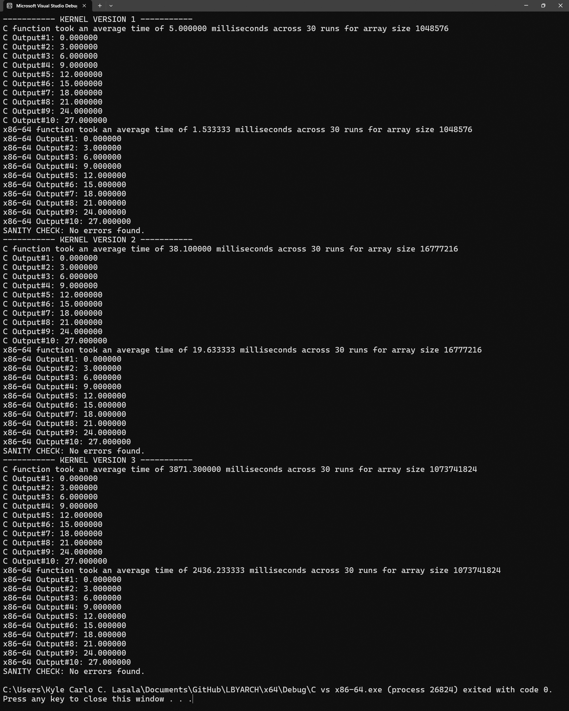
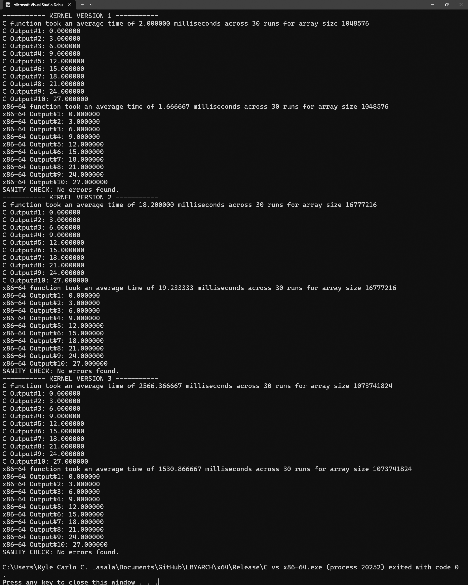

# Comparative Analysis of C and x86-64
## Overview
- This repository contains an experiment that compares the execution time between C and x86-64 assembly language, developed as a course requirement for LBYARCH (Computer Organization and Architecture Laboratory) at De La Salle University - Manila. The experiment inputs hard-coded scalar and vector values and a sample function created using C and x86-64. The accuracy of the function outputs and the speed are evaluated for this experiment.

## Steps to Run Locally
1. Download repository as ZIP
2. Open the <a href="https://github.com/KyleCarlo/C_vs_x86-64/blob/main/C%20vs%20x86-64.sln">C vs x86-64.sln</a> file through Microsoft Visual Studio 2022
3. Check that the configuration properties of the files and solution are appropriate to your local system
4. Choose Debug or Release Mode
5. Build Solution *Note: Errors may be encountered if the file properties are not configured properly*
6. Run

## Project Specifications
- Input: Takes a scalar value ***A***, vector ***X***, vector ***Y***, and integer ***n*** that defines the length of X and Y. In this experiment, the following values will be fixed (hard-coded) for consistency.
    - ***n*** is an integer value that can be an **element of {2^20, 2^24, 2^30}**
    - ***A*** is a single-precision float *(32-bit)* value of **2.0 *(2.0f)***
    - ***X*** is a vector that contains a series of single-precision float *(32-bit)* of **1,2,3,...,n**
    - ***Y*** is a vector that contains a series of single-precision float *(32-bit)* of **1,2,3,...,n**
- Process: Simulate ***SAXPY function***. SAXPY means "Single precision AX plus Y".
    - In its mathematical form, ***f(a, x, y) = ax + y*** where variable *a* is a scalar value, *x* and *y* are both vectors with the size of *n*.
- Output: The function **maps to vector Z** *(f(a, x, y) -> z)* where *Z* also has length *n*.

## Hardware Specifications
- The experiment was conducted on a computer with the following hardware specifications:
    - Processor: Intel Core I5-9300H
    - Processor Base Frequency: 2.40GHz
    - Cache: 8 MB
    - Bus Speed: 8GT/s
    - RAM size: 20GB
    - Operating System: Windows 11
    - IDE: Visual Studio 2022

## Implementation
### Main C file
- Imports the necessary header files to execute the experiment
    - *stdio.h* for standard input and output functions
    - *stdlib.h* for memory allocation (malloc) function
    - *time.h* for timer functions
    - *Windows.h* for buffer function
- Imports the SAXPY_c header file and prototyped the x86-64 function
    - *SAXPY_c.h* imports the defined function `saxpy_c`
    - The assembly subroutine is prototyped as ***void saxpy_asm(size_t n, float A, float\* X, float\* Y, float\* Z)*** where:
        - *n* is the length of *X*, *Y*, *Z* arrays 
        - *A* is a float that is a coefficient of variable X
        - \**X* and \**Y* are pointers to input X and Y arrays with size *n*
        - \**Z* is a pointer to the output Z array with size *n*
- Defines 3 different kernel versions
    - Version 1 executes C and x86-64 kernels for n = 2^20
    - Version 2 executes C and x86-64 kernels for n = 2^24
    - Version 3 executes C and x86-64 kernels for n = 2^30
- Allocates memory for *X*, *Y*, *Z* arrays each with length *n*
- Initializes the inputs
- Executes the C kernel
    - Fills the cache by calling the C kernel function once
    - Iterates the function call 30 times
    - Sets the timer in the function call for each timer
    - Take the average execution time across 30 iterations
- Executes the x86-64 kernel
    - Fills the cache by calling the x86-64 kernel function once
    - Iterates the function call 30 times
    - Sets timer in the function call for each timer *(Note: A Sleep() buffer was added after saving the start and end times of each run to prevent errors in with the time functions)*
    - Take the average execution time in 30 iterations
- Checks the results of both kernal
- Free the memory 
- Move to the next version and execute
### C kernel
- The SAXPY function is defined in C header file *(.h files)* as ***void saxpy_c(size_t n, float A, float\* X, float\* Y, float\* Z)*** where:
    - *n* is the length of *X*, *Y*, *Z* arrays 
    - *A* is a float that is a coefficient of variable X
    - \**X* and \**Y* are pointers to input X and Y arrays with size *n*
    - \**Z* is a pointer to output Z array with size *n*
- The function contains the following code:
```
for (size_t i = 0; i < n; i++) {
    Z[i] = (A * X[i]) + Y[i];
}
```
### x86-64 kernel
- The SAXPY subroutine in assembly language uses 5 general purpose registers (RCX, R8, R9, R10, RBX), RBP, and 3 floating point registers (XMM1, XMM4, XMM5).
- The following registers are volatile and are used to take the parameters when C passes the arguments (temporary information) to the prototype function.
    - ***RCX*** takes the first parameter *n*
    - ***XMM1*** takes the second parameter *A*
    - ***R8*** takes the third parameter *X*
    - ***R9*** takes the fourth parameter *Y*
- The following non-volatile register is used to get the parameter(s) passed beyond the 4th argument.
    - ***RBP*** takes the address at the base of the stack and has an offset of **+32** to take the fifth parameter *Z*
- The following is the pseudocode to implement the SAXPY function in assembly language.
    - ***R10*** temporarily saves the 5th parameter *(RBP+32)*, ***RBX*** serves as a counter, ***XMM4*** temporarily saves the X_i value, ***XMM5*** temporarily saves the Y_i value 
    - Multiply the register *XMM4* and the value at *[r8 + 4 \* rbx]* *(AX[i])* and save to register *XMM4*
    - Add the registers *XMM4* and *XMM5* *(AX[i] + Y[i])* and save to register *XMM4*
    - Save the result to *[R10 + 4 * RBX]* *(Z[i] = AX[i] + Y[i])*
    - Move the loop counter by incrementing *RBX*. If the loop counter is less than the length *n*, proceed to the next element.
- The code below shows the SAXPY function in assembly.
```
segment .text
bits 64
default rel
global saxpy_asm

saxpy_asm:
push rbp
mov rbp, rsp
add rbp, 16	

mov r10, [rbp + 32]

XOR rbx, rbx				
for_loop:
movss xmm4, [r8 + 4 * rbx]	
movss xmm5, [r9 + 4 * rbx]	

mulss xmm4, xmm1			
addss xmm4, xmm5			
		
movss [r10 + 4 * rbx], xmm4	

INC rbx						
CMP rbx, rcx				
JL for_loop

pop rbp
ret
```
## Analysis
- In Visual Studio, there are 2 given build configurations namely ***Debug*** and ***Release*** by default. Both build configurations are used to test the experiment.
    - **Debug** mode does extra checking and creates a file with the *.pdb* extension. The pdb files are necessary for detailed debugging done by the compiler.
    - **Release** mode skips the extra checking and will **not** create pdb files. The release mode will try to optimize the C compiler at its best performance.  
### Debug Mode Results

### Release Mode Results

### Summary of Results
#### Debug Mode
|Version - Vector Size|Average Run Time of C Kernel|Average Run Time of x86-64 Kernel|
|---------------------|----------------------------|---------------------------------|
|Version 1 - 2^20     |5.00ms                      |1.53ms                           |
|Version 2 - 2^24     |38.10ms                     |19.63ms                          |
|Version 3 - 2^30     |3871.30ms                   |2436.23ms                        |

#### Release Mode
|Version - Vector Size|Average Run Time of C Kernel|Average Run Time of x86-64 Kernel|
|---------------------|----------------------------|---------------------------------|
|Version 1 - 2^20     |2.00ms                      |1.67ms                           |
|Version 2 - 2^24     |18.20ms                     |19.23ms                          |
|Version 3 - 2^30     |2566.37ms                   |1530.87ms                        |
### Comparison
- In debug mode, the C kernel exhibits average execution times of 5.00, 38.10, and 3871.30 milliseconds for input sizes of 2^20, 2^24, and 2^30 respectively, while the x86-64 kernel demonstrates 1.53, 19.63, and 2436.23 milliseconds for the same inputs. As a low-level programming language, x86-64 allows the function to perform consistently faster than its C counterpart through direct optimization and efficient utilization of hardware resources. 
- In release mode, the C kernel shows execution times of 2.00, 18.20, and 2566.37 milliseconds, for input sizes of 2^20, 2^24, and 2^30 respectively, whereas the x86-64 kernel displays 1.67, 19.23, and 1530.87 milliseconds for the corresponding input sizes. The performance comparison between the two kernels in release mode varies. Although there are instances where the x86-64 kernel outperforms its C counterpart, there is also one where the C kernel exhibited faster execution times. This inconsistency arises due to the optimization features available for C in release mode. For instance, it would not save certain temporary values that would otherwise be saved in debug mode.
- Overall, programs created using x86-64 are generally expected to run faster than their C counterparts. However, optimizations whether by the programmer or the compiler can affect the speed of these programs.
## Authors
- Kyle Carlo Lasala (kyle_lasala@dlsu.edu.ph)
- Maria Monica Manlises (maria_monica_manlises@dlsu.edu.ph)
